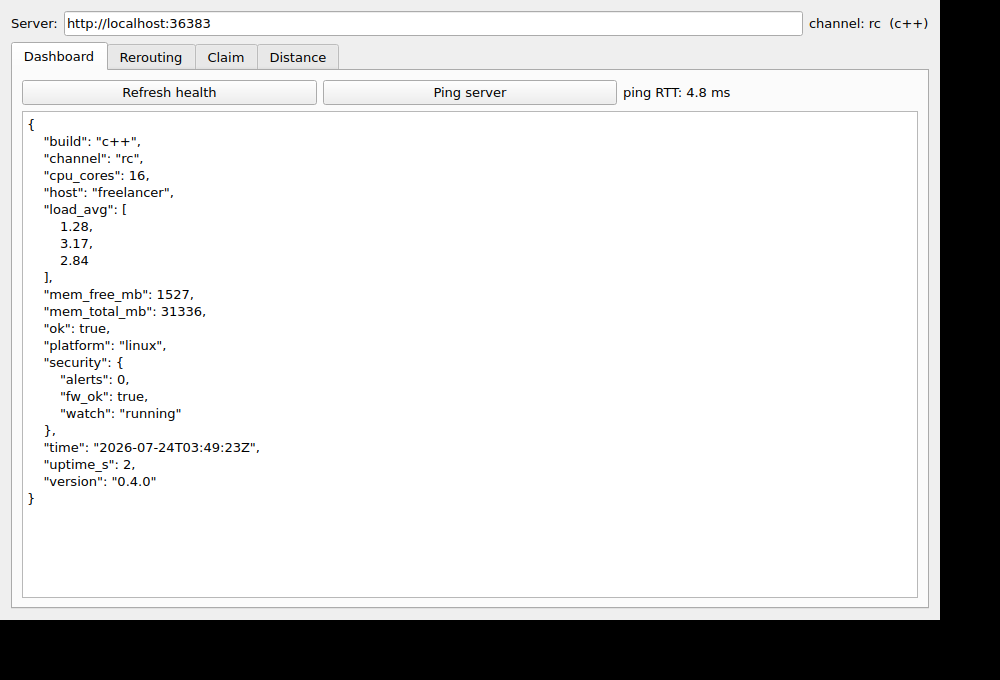
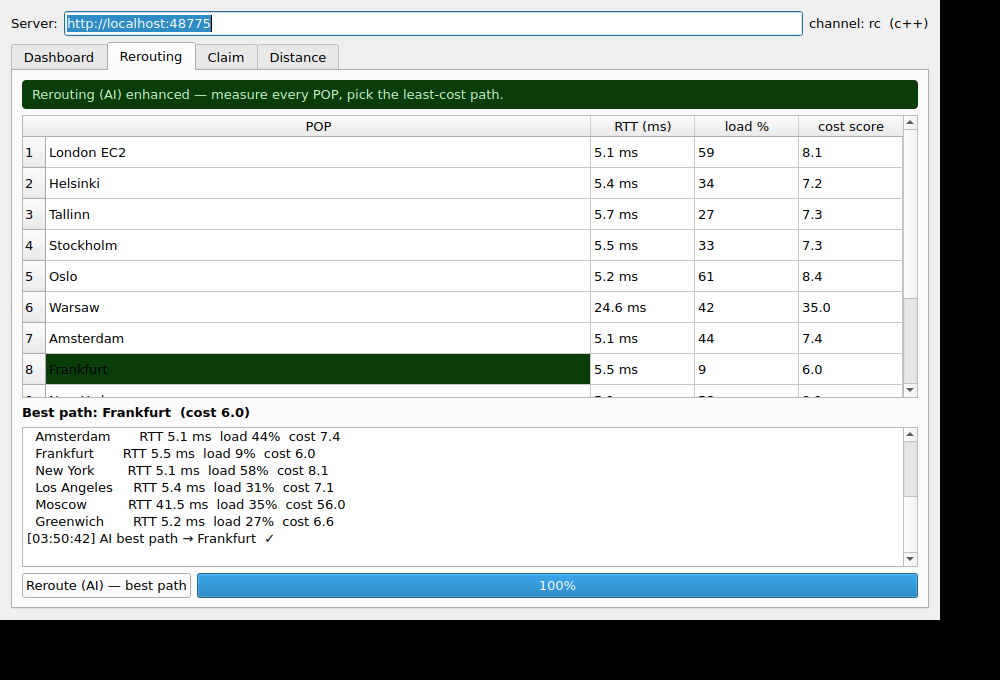

# 6GGW / NetSwitch — Qt desktop client

The **app base built with Qt** (Qt.com). One C++/Qt Widgets source that Qt Creator compiles to
**Windows, Linux, macOS** — and, with the mobile kits installed, to **native iOS and Android** —
from the exact same code. It talks to the 6GGW server component over its HTTP API, and it does its
own real TCP-handshake RTT for the rerouting view, so the least-cost path is measured live on the
device.



## Tabs

| Tab        | What it does |
|------------|--------------|
| **Dashboard** | Point at a server (URL bar at the top), read `/api/health` (channel, cores, load, memory, uptime, security watch) and time a `ping`. Auto-loads on launch. |
| **Rerouting** | The focus. Measures a real TCP-handshake RTT to every POP, shows a live utilisation indicator per POP, scores the least-cost path (`cost = RTT × (1 + load/100)`), highlights the AI-recommended best path, and streams a per-POP log. Progress bar while probing. |
| **Claim** | Keep the network warm: keep-alive claims at **2 / 3 / 5 per minute** (you pick). Mean interval = 60000/rate, with an A/B set alternation and ±20% jitter so it never falls into a fixed cadence — same spec as the phone app. Live claim count, last RTT, next-claim countdown, log. |
| **Distance** | Real signal-path km to any host, via the server's `/api/distance` (best-of-3 TCP RTT, cable constant d = 0.0001607 m/ps). |



## Build

### The normal way — Qt Creator (recommended, this is the "Qt.com" path)
1. Open `ggw-client.pro` **or** `CMakeLists.txt` in Qt Creator.
2. Pick a kit (Desktop for Windows/Linux/macOS; an Android or iOS kit for mobile).
3. Press **Run**. That's it — the same project builds for every target.

### Command line (desktop)
```
cmake -B build -DCMAKE_BUILD_TYPE=Release && cmake --build build -j
# or, with a system Qt5 and no cmake:
g++ -std=c++17 -fPIC main.cpp -o ggw_client_qt $(pkg-config --cflags --libs Qt5Widgets Qt5Network)
```
Works with **Qt6 (preferred) or Qt5** — the CMake file auto-detects. The code deliberately uses no
`Q_OBJECT`/moc (all signals connect to lambdas), so it also builds with a bare g++ line.

### Native iOS / Android (from this same source)
- **Android:** install Qt for Android + the Android NDK/SDK in Qt Creator, add the Android kit,
  press Run. Qt Creator generates the Gradle project and the `.apk`/`.aab`.
- **iOS:** install Qt for iOS on a Mac with Xcode, add the iOS kit, set your signing team, press Run.
  Qt Creator generates the Xcode project and the `.ipa`.

No source changes are needed for either — the networking (`QNetworkAccessManager`, `QTcpSocket`)
and the UI (`QtWidgets`) are all cross-platform Qt.

## Run

```
./ggw_client_qt
GGW_SERVER=http://site-a.example:8090 ./ggw_client_qt     # preset the server URL
```
The server URL can be changed live in the top bar, or preset with the `GGW_SERVER` env var.

## Notes on honesty
- **RTT is really measured** — a live TCP handshake to each POP/host, the same method the server
  uses for `/api/distance`. It is the portable stand-in for a raw ICMP traceroute (which needs root
  and is blocked on most networks).
- **load %** is a per-POP link-utilisation indicator used only to weight the cost score; it is
  labelled as such in the UI. RTT, ping and distance are the hard measurements.
